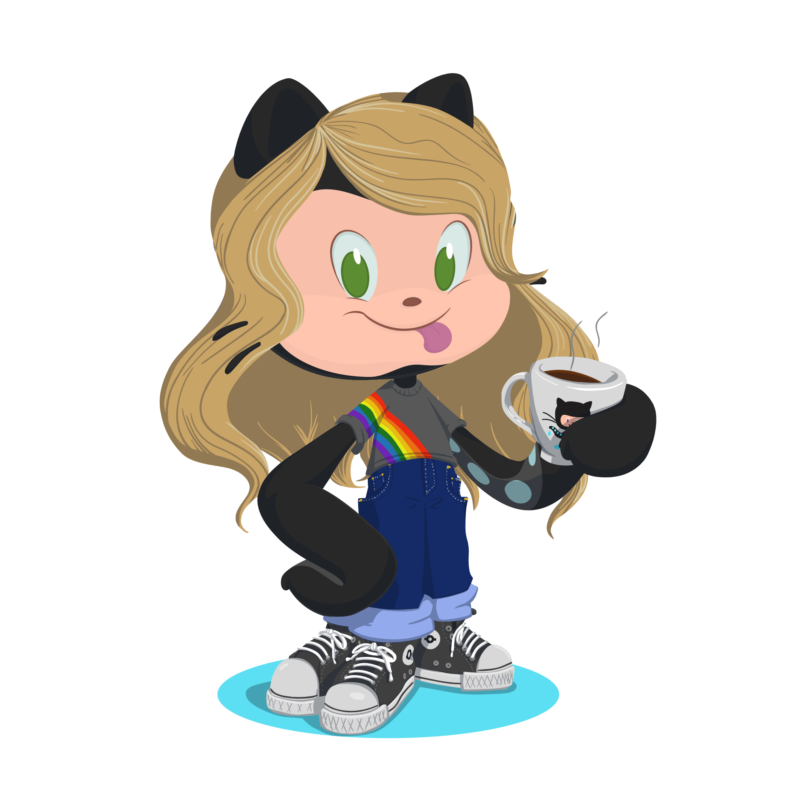

# Hi 👋, I'm Byanca
## A passionate front end developer from Brazil
######

- 🔭 I’m currently working on **Trivia**

- 🌱 I’m currently learning **redux and hooks**

- 🤝 I’m looking for help with **CSS improvements**

- 💬 Ask me about **JavaScript, music and games**

- 📫 How to reach me **linkedin.com/in/byancaknorst/**

- ⚡ Interesting fact **I'm graduated in engineering and making career transition**

   
   
   
  
   
   
   
   
   
   

 
